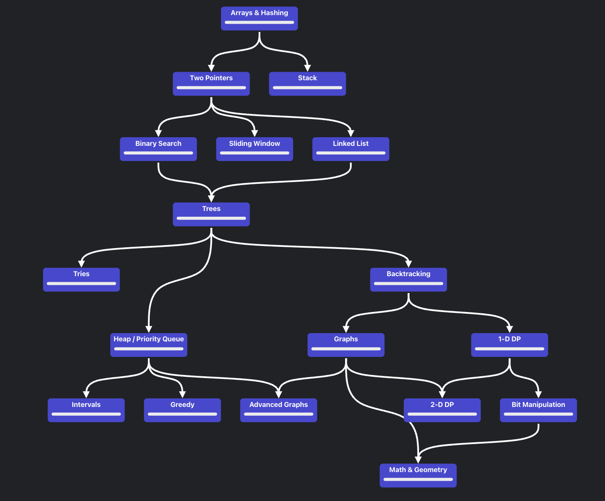

# 🚀 My LeetCode Journey 🚀

Welcome to my **LeetCode Journey**! This repository contains all my solutions to LeetCode problems. I'm documenting my journey as I tackle a variety of data structures and algorithmsl challenges to improve my problem-solving skills.

I will be following [Neetcode.io's](https://neetcode.io/roadmap) Roadmap.

---

## 🧠 **Goals**
- Solve at least **100+** problems by the end of the year
- Cover all major topics: Arrays, Linked Lists, Trees, Graphs, Dynamic Programming, and more
- Achieve consistency by solving problems every week

---

## 🏆 **Progress Overview**

- **Total Problems Solved**: `3`
- **Easy**: `3`
- **Medium**: `N/A`
- **Hard**: `N/A`

---

## 📋 **Problems Summary Table**

| Problem Name | Topic         | Difficulty | Solution Link                      | Language Used |
|--------------|---------------|------------|------------------------------------|---------------|
| Two Sum      | Arrays        | Easy       | [Solution](./arrays/easy/1-two-sum.js) | JavaScript        |
| Contains Duplicates | Arrays | Easy  | [Solution](./arrays/easy/217-contains-duplicates.js) | JavaScript |
| Valid Anagrams | Strings, Arrays | Easy | [Solution](./arrays/easy/242-valid-anagrams.js) | JavaScript |

---
